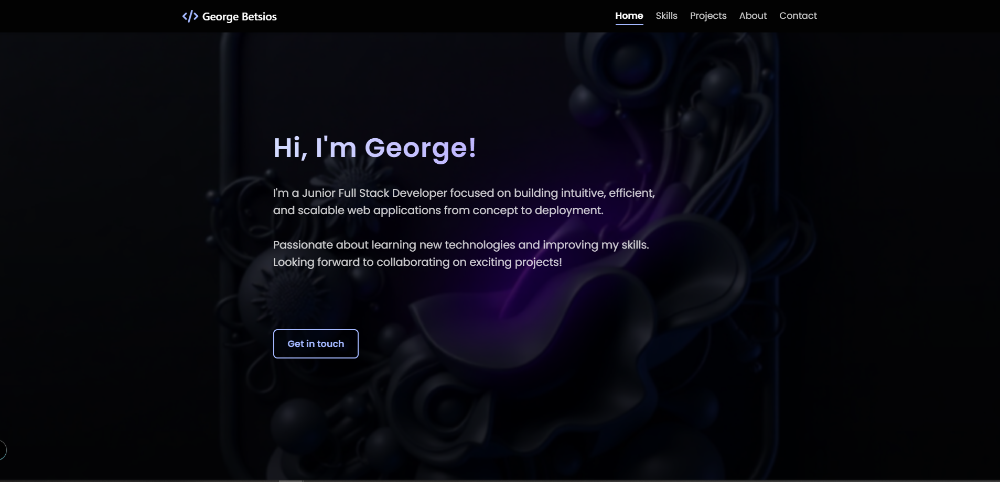
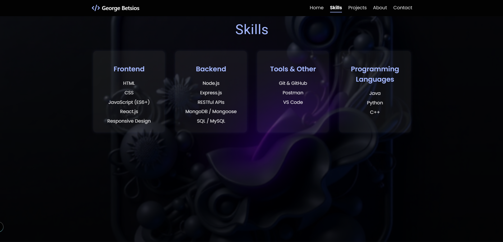
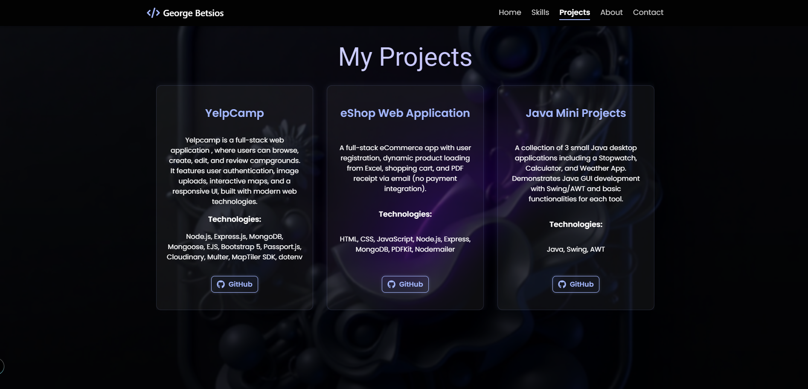
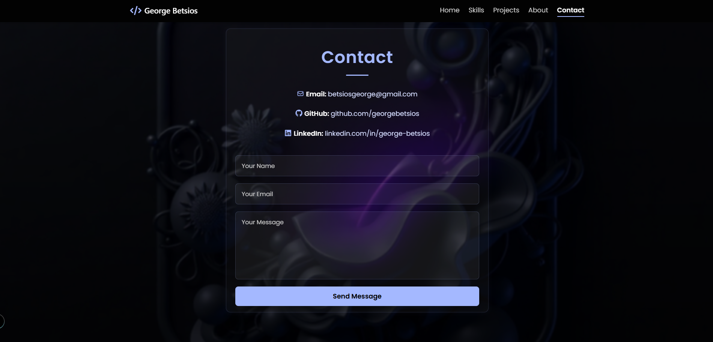

# 🌐 George Betsios - Developer Portfolio

🔗 [Live Demo](https://georgebetsios.github.io/myPortfolio/)

This is my personal developer portfolio built with **React.js**.  
It showcases my **projects**, **skills**, and includes a **contact form** that sends emails using **EmailJS**.

---

## 🧭 Sections

- 🏠 Home
- 👨‍💻 About
- 🧠 Skills
- 💼 Projects
- 📬 Contact

---

## ✨ Features

- 🔹 **Responsive Design** – optimized for desktop, tablet, and mobile
- 🔹 **Smooth Navigation** – scrolls to sections: Home, About, Skills, Projects, Contact
- 🔹 **Custom Styling** – with modular CSS for each section
- 🔹 **Animated Contact Form** – with loading spinner and success/error messages
- 🔹 **Email Integration** – contact form uses EmailJS to send messages
- 🔹 **FontAwesome + HeroIcons** – for visual enhancement with icons

---

## 🛠️ Tech Stack

- **React.js** (Vite)
- **JavaScript (ES6+)**
- **CSS Modules**
- **EmailJS**
- **React Icons**

---

## 📸 Screenshots

### 🏠 Home Section


### 🧠 Skills Section  


### 💼 Projects Section


### 📬 Contact Form


---

## 📁 Project Structure
portfolio/
├── public/
├── src/
│ ├── assets/ # images, icons, backgrounds
│ ├── components/ # reusable React components (e.g., Navbar, Footer)
│ ├── sections/ # Home, About, Skills, Projects, Contact
│ ├── styles/ # CSS files (modular per section)
│ ├── App.jsx
│ └── main.jsx
├── .env # EmailJS API keys (not committed)
├── package.json
└── README.md


---


## 📩 Contact Form Setup (EmailJS)

1. Go to [https://www.emailjs.com](https://www.emailjs.com)
2. Create an account and a service
3. Create an email template with `name`, `email`, and `message`
4. In your `.env` file, add:

```env
VITE_SERVICE_ID=your_service_id
VITE_TEMPLATE_ID=your_template_id
VITE_PUBLIC_KEY=your_public_key

---

# Clone the repo
git clone https://github.com/georgebetsios/portfolio.git
cd portfolio

# Install dependencies
npm install

# Start the development server
npm run dev


